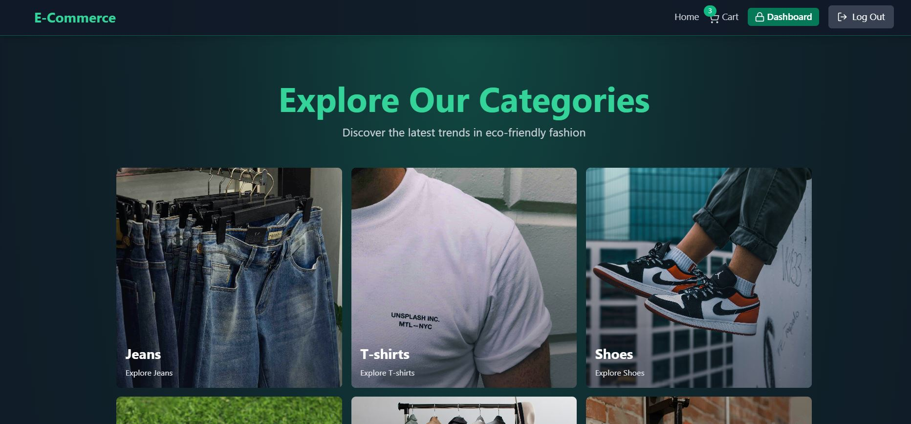

# 🚀 Full-Stack E-Commerce Platform (MERN Stack + Stripe + Redis)

Welcome to my Full-Stack E-Commerce platform! This project is built using the **MERN stack** (MongoDB, Express, React, Node.js) with advanced features such as **Stripe Payment Integration**, **Redis caching**, and **JWT-based authentication**. It demonstrates a real-world application with a focus on **scalability**, **security**, and **performance**.

---

## 📌 **Table of Contents**

- [Features](#features)
- [Tech Stack](#tech-stack)
- [Installation](#installation)
- [Environment Variables](#environment-variables)
- [Running the Application](#running-the-application)
- [Project Screenshots](#project-screenshots)
- [Future Enhancements](#future-enhancements)
- [Contributing](#contributing)
- [Contact](#contact)
- [License](#license)

---

## 🔥 **Features**

This eCommerce platform comes with a wide array of features designed for both customers and administrators:

### **Core Features:**

- 🛒 **Shopping Cart Functionality**: Add products to the cart and manage the cart across sessions.
- 💳 **Checkout with Stripe**: Seamless payment processing using Stripe's secure payment gateway.
  
- 🏷️ **Coupon Code System**: Apply discount codes at checkout to reduce the total price.
- 📦 **Product & Category Management**: Admins can create, update, and delete products and categories.
- 👑 **Admin Dashboard**: Includes an admin panel for managing products, users, orders, and sales analytics.
- 📊 **Sales Analytics**: Visual representation of sales data for admins.
  

### **Advanced Features:**

- 🔐 **JWT Authentication**: Secure login, signup, and user management with access/refresh tokens.
- 🔄 **Refresh Token System**: Ensures long-term sessions while maintaining security.
- 🚀 **Caching with Redis**: Improved performance using Redis for session and data caching.
- 🔒 **Data Protection & Security**: Focused on best practices for data protection.
- 🛍️ **Complete Cart & Checkout Process**: Users can manage their cart and proceed to checkout with payment.

### **Frontend Design:**

- 🎨 **Tailwind CSS**: Responsive and modern UI built with Tailwind for fast design iteration.

---

## 🛠️ **Tech Stack**

This project is built using the following technologies:

- **Frontend**: React.js, Tailwind CSS
- **Backend**: Node.js, Express.js
- **Database**: MongoDB
- **Caching**: Redis
- **Payments**: Stripe API
- **Authentication**: JWT (JSON Web Tokens)
- **Version Control**: Git

---
